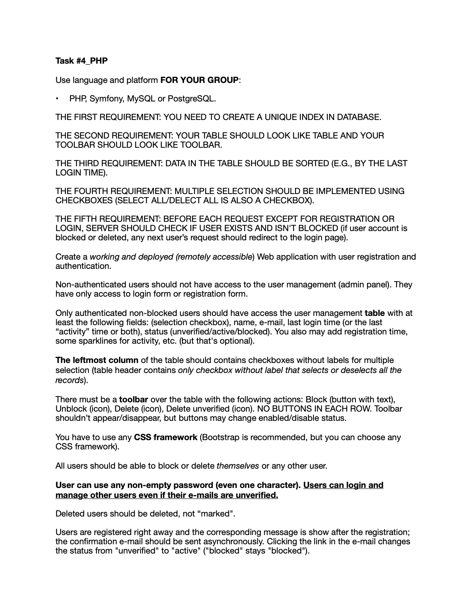
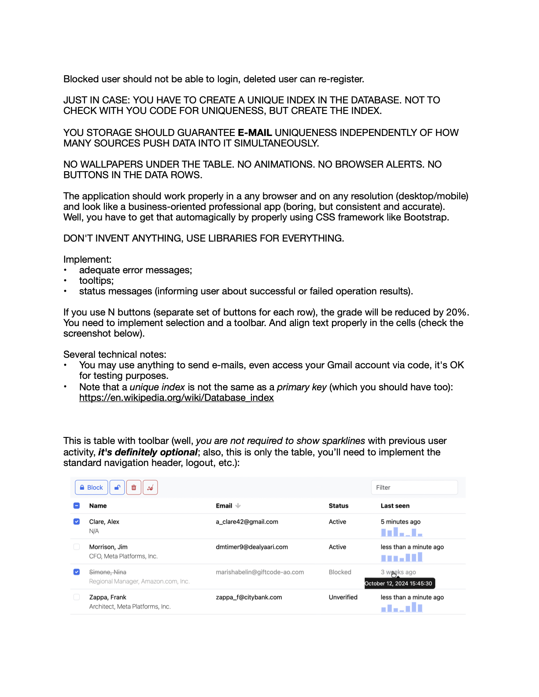
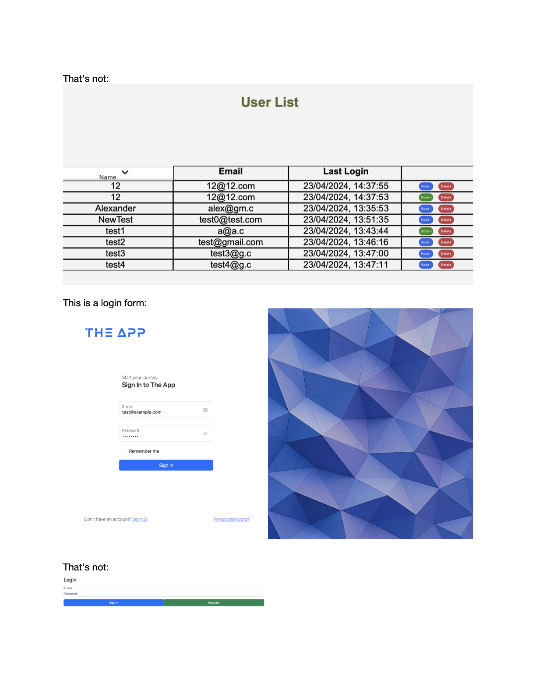

# Task 4 (PHP)

## Problem Statement

## Solution

### Tech Stack

- Symfony Framework
- Doctrine ORM
- PostgreSQL Database
- Twig Templating Engine
- Tailwind CSS

### Features Implemented

- User Registration and Authentication
- User Email Verification
- Admin Panel with User Management
- User blocking/unblocking
- Single or bulk user deletion/blocking/unblocking
- Pagination for user list
- Responsive design with Tailwind CSS
- Input validation and error handling
- Unique email enforcement with database index
